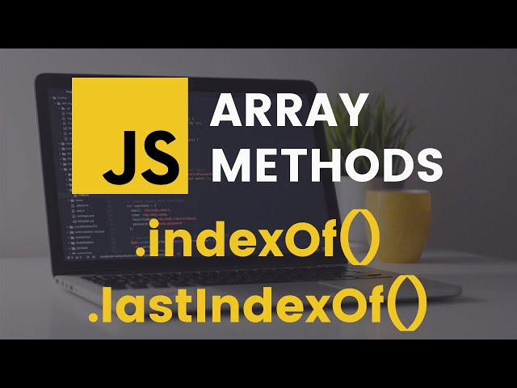

# Array in JavaScript
>An array is an object that holds values (of any type) not particularly in named properties/keys, 
but rather in numerically indexed position
In JavaScript, an array is an ordered list of values. Each value is called an element specified by 
an index. ... First, an array can hold values of mixed types.
An array is a special variable, which can hold more than one value:

# CHANGE ELEMENTS IN ARRAY
>You can also add elements or change the elements by accessing the index value
Suppose, an array has two elements. If you try to add an element at index 3 (fourth 
element), the third element will be undefined. For example,

# Array methods

# array method push
>The push() method of Array instances adds the specified elements to the end of an array and returns the new length of the array.
.jpg)
# array method pop
>The pop() method removes the last element from an array and returns that value to the caller. If you call pop() on an empty array, it returns undefined . Array.prototype.shift() has similar behavior to pop() , but applied to the first element in an array.
.jpg)
# array method unshift 
>The unshift() method adds one or more elements to the beginning of an array and
returns the new length of the array. 
unshift(element0, element1, /* … ,*/ elementN) 

# array method shift
>The pop() method removes the last element from an array and returns that element. 
This method changes the length of the array. 

# array method toString
>The toString() method returns a string representing the specified array and its
elements. 
A string representing the elements of the array.
.jpg)
# JavaScript array methods
>The indexOf() method returns the first index (position) of a specified value. The indexOf() method returns -1 if the value is not found. The indexOf() method starts at a specified index and searches from left to right. By default the search starts at the first element and ends at the last.

# Includes
>Description. The includes() method returns true if a string contains a specified string. Otherwise it returns false . The includes() method is case sensitive.

# JavaScript array methods Slice

# JavaScript array method map
> The map() method is an iterative method. It calls a provided callbackFn function once for each element in an array and constructs a new array 
.jpg)
# JavaScript array method foreach()
>The forEach() method is an iterative method. It calls a provided callbackFn function once for each element in an array in ascending-index order. Unlike map() , forEach() always returns undefined and is not chainable. The typical use case is to execute side effects at the end of a chain.
.jpg)
# JavaScript array method find()
>The find() method returns the value of the first element that passes a test. The find() method executes a function for each array element. The find() method returns undefined if no elements are found. The find() method does not execute the function for empty elements.
.jpg)
# Method reduce 
>The reduce() method executes a user-supplied "reducer" callback function on each element
of the array, in order, passing in the return value from the calculation on the preceding
element. The final result of running the reducer across all elements of the array is a single
value.

# Method filter
>The filter() method creates a shallow copy of a portion of a given array, filtered down to
just the elements from the given array that pass the test implemented by the provided
function. 
.jpg)
# Method Destructuring
>The toSorted() method of Array instances is the copying version of the sort() method. 
It returns a new array with the elements sorted in ascending order.

# Method spread
>The spread (...) syntax allows an iterable, such as an array or string, to be
expanded in places where zero or more arguments (for function calls) or
elements (for array literals) are expected. In an object literal, the spread syntax
enumerates the properties of an object and adds the key-value pairs to the object
being created.

# Method rest
> The rest parameter syntax allows a function to accept an indefinite 
number of arguments as an array.

#
# Thank you for watching !
